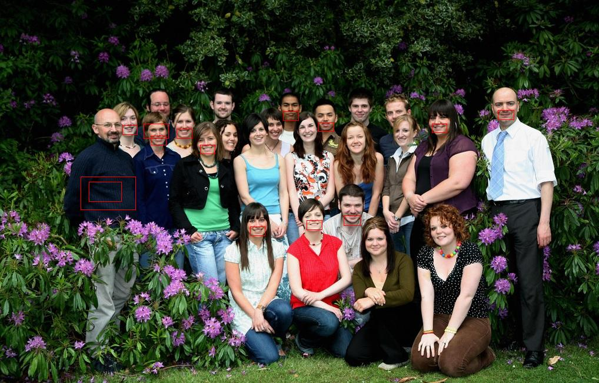

## 人脸识别

该人脸识别Demo是基于OpenCV中的cv2实现的，python语言，代码请见下列文件！

- [face_detect.py](./face_detect.py) 具体解释参考代码

说明，haarcascades里面的xml文件是OpenCV自带的训练好的分类器，但是必须以灰度图作为输入。CentOS系统中默认情况下，clf的路径是在/usr/share/OpenCV/haarcascades/下，这里为了方便，我将其拷贝到本目录下。本Demo只使用了两个分类器，一个是face，一个是mouth，如果需要测试其它的，想改clf参数即可！

## 库的依赖

首先要在CentOS 6.5下安装下列依赖，确保不缺少相关包.

- numpy (在centos系统中使用pip安装`yum install numpy`)
- python-opencv* (在centos系统中使用pip安装`yum install opencv*`)
- PIL模块 (在centos系统中使用pip安装`pip install Pillow`)

关于pip的安装，参考：[Python学习-安装pip和scikit-learn](http://blog.csdn.net/dream_angel_z/article/details/45828189)

## 测试及结果

CentOS系统下运行：`python face_detect.py` 即可， 相关参数可在main函数里面指定。

最后输出./*.face.jpg, ./*.mouth.jpg文件，以及*_faces目录（保存识别出来的人脸）!

输出结果中，人脸识别的效果是最好的，而嘴巴识别次之,由于眼睛和笑脸识别效果不好，因此代码中就注释掉了，不过在有些图片上面显示的效果还不错！

识别人脸的效果图：

识别mouth的效果图：

## 参考文献

- [Face Recognition With Python, in Under 25 Lines of Code](https://realpython.com/blog/python/face-recognition-with-python/)
- [Python-OpenCV人脸检测(代码)](http://blog.csdn.net/u012162613/article/details/43523507)

